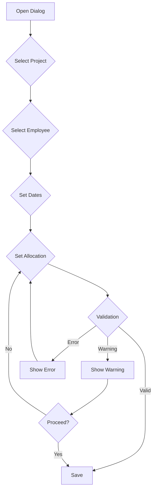

# Assignment Management Workflow

## Creating an Assignment

### 1. From Timeline View
1. Navigate to "Resource Planning" in the main menu
2. View the timeline grid showing employees and dates
3. Two ways to create an assignment:
   - Click an empty cell on the desired date/employee
   - Click and drag across multiple days for date range
4. Assignment dialog opens with:
   - Pre-filled employee and dates
   - Project dropdown
   - Role input
   - Allocation percentage slider (10% steps)
   - Real-time workload validation

### 2. From Project View
1. Navigate to "Projects" in the main menu
2. Select a project
3. Click "Add Assignment" button
4. Assignment dialog opens with:
   - Pre-filled project
   - Employee dropdown
   - Date range picker
   - Role input
   - Allocation percentage slider
   - Real-time workload validation

## Assignment Dialog



### Fields
- **Project**: Dropdown with active projects
- **Employee**: Dropdown with available employees
- **Date Range**: Start and end date pickers
- **Role**: Text input with suggestions
- **Allocation**: Slider with 10% steps (10-100%)
- **DR Status**: Dropdown (DR1, DR2, etc.)
- **Position Status**: Dropdown (P1, P2, etc.)

### Real-time Feedback
- Workload percentage shown for selected period
- Color-coded warnings:
  - Green: ≤ 80% total workload
  - Yellow: > 80% total workload
  - Red: > 100% total workload
- Conflict warnings:
  - Overlapping 100% assignments
  - Assignments outside project dates
  - Assignments during absences

## Editing an Assignment

1. Click on an existing assignment bar in the timeline
2. Assignment dialog opens with:
   - All current values pre-filled
   - Option to modify any field
   - Real-time validation of changes
   - Warning if changes affect other assignments

### Quick Actions
- Drag assignment bar to change dates
- Drag edges to resize (change duration)
- Right-click menu for common actions:
  - Modify allocation
  - End assignment
  - Copy assignment
  - Delete assignment

## Viewing Assignment Details

### Timeline View
- Hover over assignment bar shows:
  - Project name
  - Role
  - Allocation percentage
  - Date range
  - Total workload for period
- Color coding indicates:
  - Project type
  - Workload status
  - Warnings/conflicts

### List View
- Sortable columns:
  - Project
  - Employee
  - Role
  - Start/End dates
  - Allocation
  - Status
- Filters for:
  - Date range
  - Project
  - Employee
  - Allocation range
  - Status

## Bulk Operations

### Copy Assignments
1. Select source assignments
2. Click "Copy" action
3. Select target dates
4. Validate workload
5. Confirm copy

### End Multiple Assignments
1. Select assignments
2. Click "End Assignments"
3. Set end date
4. Add termination reason
5. Confirm changes

## Validation Rules

### Assignment Creation
- Allocation must be in 10% steps
- Total workload cannot exceed 100%
- Dates must be within project timeline
- No conflicts with absences
- No overlapping 100% assignments

### Date Changes
- Must be within project timeline
- Cannot create gaps in required coverage
- Must respect minimum assignment duration

### Allocation Changes
- Must maintain minimum project staffing
- Cannot exceed employee availability
- Must be approved if over 80%

## Success Messages

### Creation Success
```
Assignment created successfully:
[Employee Name] assigned to [Project Name]
[Start Date] - [End Date] at [Allocation]%
```

### Update Success
```
Assignment updated:
Changed [Field] from [Old Value] to [New Value]
New total workload: [Percentage]%
```

### Warning Messages
```
Warning: High workload
Total workload will be [Percentage]%
Consider reducing allocation or adjusting dates
```

## Error Messages

### Validation Errors
```
Cannot create assignment:
- Total workload would exceed 100%
- Assignment overlaps with absence
- Dates outside project timeline
```

### Conflict Errors
```
Assignment conflicts detected:
- Overlaps with 100% assignment
- Conflicts with project requirements
- Invalid allocation step (use 10% increments)