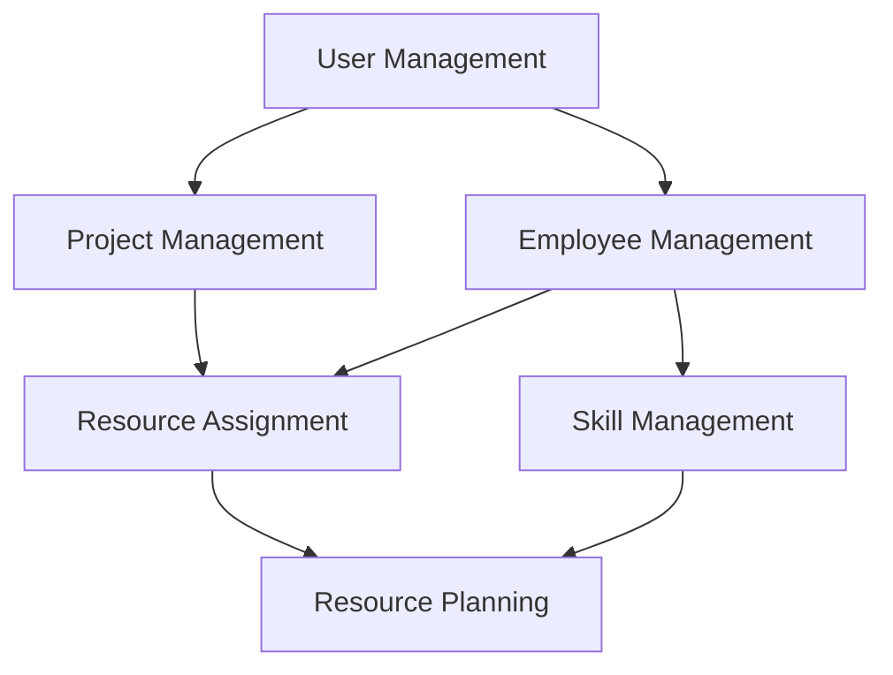

# Backlog Prioritization

## Priority Levels
- P1: Must have for MVP (Critical Path)
- P2: Important but not blocking MVP
- P3: Nice to have
- P4: Future enhancement

## Core System Dependencies

## Prioritized Features

### Phase 1: Foundation (P1)
1. **User Management (US-1)**
   - Critical for system access
   - Required for all other features
   - Low complexity, low risk
   - Implementation time: 1-2 sprints

2. **Basic Employee Management (US-3.1)**
   - Core data structure
   - Required for project assignments
   - Medium complexity, low risk
   - Implementation time: 2-3 sprints

3. **Project Management (US-2)**
   - Core business functionality
   - Depends on User Management
   - Medium complexity, medium risk
   - Implementation time: 2-3 sprints

### Phase 2: Core Operations (P2)
4. **Resource Assignment (US-2.1)**
   - Critical for resource planning
   - Depends on Projects and Employees
   - High complexity, medium risk
   - Implementation time: 3-4 sprints

5. **Absence Management (US-3.3)**
   - Required for accurate resource planning
   - Depends on Employee Management
   - Medium complexity, low risk
   - Implementation time: 2-3 sprints

6. **Basic Availability Management (US-3.4)**
   - Essential for project planning
   - Depends on Resource Assignment
   - High complexity, medium risk
   - Implementation time: 3-4 sprints

### Phase 3: Enhancement (P3)
7. **Qualification Management (US-3.2)**
   - Enhances resource planning
   - Depends on Employee Management
   - Medium complexity, low risk
   - Implementation time: 2-3 sprints

8. **Resource Utilization (US-4.1)**
   - Provides planning insights
   - Depends on Resource Assignment
   - High complexity, medium risk
   - Implementation time: 3-4 sprints

### Phase 4: Optimization (P4)
9. **Skill Development (US-3.5)**
   - Career development feature
   - Depends on Qualification Management
   - Medium complexity, low risk
   - Implementation time: 2-3 sprints

## Risk Assessment

### Technical Risks
1. Data consistency in concurrent operations
2. Performance with large datasets
3. Integration complexity between modules

### Business Risks
1. User adoption of new system
2. Data migration from existing systems
3. Process changes required

## Implementation Strategy

### Sprint 1-2: Foundation
- Setup development environment
- Implement user management
- Begin employee management

### Sprint 3-4: Core Data
- Complete employee management
- Implement project management
- Basic data validation

### Sprint 5-6: Resource Management
- Resource assignment
- Basic availability calculation
- Absence management

### Sprint 7-8: Planning Tools
- Enhanced availability management
- Resource utilization views
- Basic reporting

### Sprint 9-10: Enhancement
- Qualification management
- Skill tracking
- Advanced reporting

## Success Metrics
1. **System Adoption**
   - 100% user registration
   - Daily active users > 80%

2. **Data Quality**
   - Resource allocation accuracy > 95%
   - Project data completeness > 98%

3. **Performance**
   - Page load times < 2s
   - Report generation < 5s

4. **Business Impact**
   - Resource utilization improvement > 15%
   - Planning efficiency improvement > 25%

## Review Points
- Weekly progress reviews
- Bi-weekly stakeholder demos
- Monthly milestone assessments
- Quarterly strategy alignment

## Adjustment Criteria
- User feedback from early phases
- Performance metrics from production
- Resource availability changes
- Business priority shifts