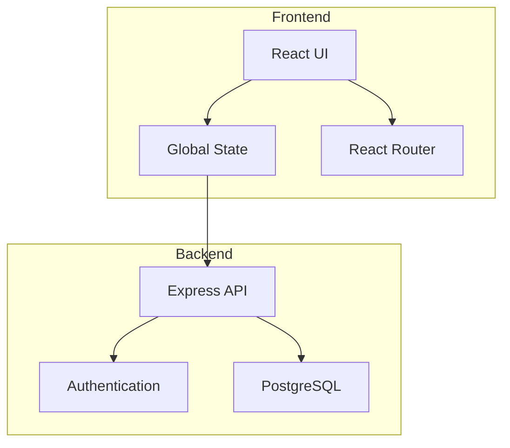
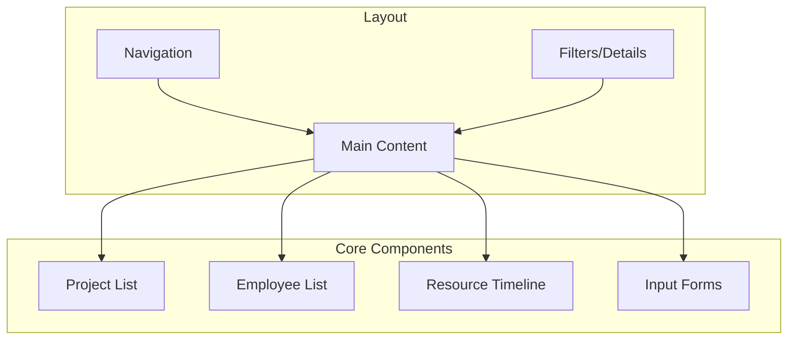

# MVP Technical Architecture

## System Overview



## Component Architecture

### Frontend Components



## Data Models

### Project
```typescript
interface Project {
    id: string;
    name: string;
    startDate: Date;
    endDate: Date;
    projectLeaderId: string;
    status: 'active' | 'completed';
    createdAt: Date;
    updatedAt: Date;
}
```

### Employee
```typescript
interface Employee {
    id: string;
    name: string;
    email: string;
    role: 'admin' | 'project_leader' | 'team_member';
    workload: number; // Percentage (e.g., 100 for full-time)
    status: 'active' | 'inactive';
}
```

### Assignment
```typescript
interface Assignment {
    id: string;
    projectId: string;
    employeeId: string;
    startDate: Date;
    endDate: Date;
    workload: number; // Percentage of time allocated
    createdAt: Date;
    updatedAt: Date;
}
```

## Database Schema

```sql
CREATE TABLE projects (
    id UUID PRIMARY KEY DEFAULT uuid_generate_v4(),
    name VARCHAR(100) NOT NULL,
    start_date DATE NOT NULL,
    end_date DATE NOT NULL,
    project_leader_id UUID REFERENCES employees(id),
    status VARCHAR(20) NOT NULL DEFAULT 'active',
    created_at TIMESTAMP WITH TIME ZONE DEFAULT CURRENT_TIMESTAMP,
    updated_at TIMESTAMP WITH TIME ZONE DEFAULT CURRENT_TIMESTAMP
);

CREATE TABLE employees (
    id UUID PRIMARY KEY DEFAULT uuid_generate_v4(),
    name VARCHAR(100) NOT NULL,
    email VARCHAR(255) NOT NULL UNIQUE,
    role VARCHAR(20) NOT NULL,
    workload INTEGER NOT NULL DEFAULT 100,
    status VARCHAR(20) NOT NULL DEFAULT 'active',
    created_at TIMESTAMP WITH TIME ZONE DEFAULT CURRENT_TIMESTAMP,
    updated_at TIMESTAMP WITH TIME ZONE DEFAULT CURRENT_TIMESTAMP
);

CREATE TABLE assignments (
    id UUID PRIMARY KEY DEFAULT uuid_generate_v4(),
    project_id UUID REFERENCES projects(id),
    employee_id UUID REFERENCES employees(id),
    start_date DATE NOT NULL,
    end_date DATE NOT NULL,
    workload INTEGER NOT NULL,
    created_at TIMESTAMP WITH TIME ZONE DEFAULT CURRENT_TIMESTAMP,
    updated_at TIMESTAMP WITH TIME ZONE DEFAULT CURRENT_TIMESTAMP,
    CONSTRAINT valid_dates CHECK (end_date >= start_date),
    CONSTRAINT valid_workload CHECK (workload BETWEEN 0 AND 100)
);
```

## API Design

### Projects API

```typescript
// GET /api/projects
interface ListProjectsResponse {
    projects: Project[];
    total: number;
}

// POST /api/projects
interface CreateProjectRequest {
    name: string;
    startDate: string; // ISO date
    endDate: string; // ISO date
    projectLeaderId: string;
}

// GET /api/projects/:id
interface GetProjectResponse extends Project {
    assignments: Assignment[];
    projectLeader: Employee;
}
```

### Employees API

```typescript
// GET /api/employees
interface ListEmployeesResponse {
    employees: Employee[];
    total: number;
}

// POST /api/employees
interface CreateEmployeeRequest {
    name: string;
    email: string;
    role: string;
    workload: number;
}

// GET /api/employees/:id/assignments
interface GetEmployeeAssignmentsResponse {
    assignments: (Assignment & {
        project: Project;
    })[];
}
```

### Assignments API

```typescript
// POST /api/assignments
interface CreateAssignmentRequest {
    projectId: string;
    employeeId: string;
    startDate: string; // ISO date
    endDate: string; // ISO date
    workload: number;
}

// GET /api/assignments
interface ListAssignmentsResponse {
    assignments: (Assignment & {
        project: Project;
        employee: Employee;
    })[];
    total: number;
}
```

## Frontend Architecture

### State Management
```typescript
interface AppState {
    projects: {
        items: Project[];
        loading: boolean;
        error: string | null;
    };
    employees: {
        items: Employee[];
        loading: boolean;
        error: string | null;
    };
    assignments: {
        items: Assignment[];
        loading: boolean;
        error: string | null;
    };
    ui: {
        selectedProject: string | null;
        selectedEmployee: string | null;
        timelineView: {
            startDate: Date;
            endDate: Date;
            filter: {
                project?: string;
                employee?: string;
            };
        };
    };
}
```

### Timeline Component

```typescript
interface TimelineProps {
    startDate: Date;
    endDate: Date;
    assignments: Assignment[];
    onAssignmentClick: (assignment: Assignment) => void;
    onTimeRangeChange: (start: Date, end: Date) => void;
}

interface TimelineState {
    zoom: 'day' | 'week' | 'month';
    visibleRange: {
        start: Date;
        end: Date;
    };
}
```

## Technical Considerations

### Performance
1. **Data Loading**
   - Pagination for lists (20 items per page)
   - Infinite scroll for timeline
   - Caching of frequently accessed data

2. **State Management**
   - Optimistic updates for better UX
   - Debounced search/filter operations
   - Cached API responses

3. **Timeline Rendering**
   - Virtualized rendering for large datasets
   - Canvas-based rendering for smooth scrolling
   - Throttled resize/scroll handlers

### Security
1. **Authentication**
   - JWT-based authentication
   - Token refresh mechanism
   - Secure cookie storage

2. **Authorization**
   - Role-based access control
   - Resource-level permissions
   - API endpoint protection

### Data Integrity
1. **Validation**
   - Frontend form validation
   - API request validation
   - Database constraints

2. **Consistency**
   - Transaction support for related operations
   - Optimistic locking for concurrent edits
   - Data normalization

## Implementation Phases

### Sprint 1-2: Project Management
1. Setup development environment
2. Implement basic authentication
3. Create project CRUD operations
4. Build project list view

### Sprint 2-3: Employee Management
1. Implement employee data model
2. Create employee CRUD operations
3. Build employee list view
4. Add basic search/filter

### Sprint 3-4: Resource Assignment
1. Implement assignment data model
2. Create assignment operations
3. Add validation rules
4. Build assignment interface

### Sprint 4-5: Timeline View
1. Implement timeline component
2. Add drag-drop functionality
3. Create filter system
4. Optimize performance

## Technical Debt Considerations
1. Initial simplified data models
2. Basic validation rules
3. Limited error handling
4. Core security features only
5. Essential UI components

## Future Extensibility
1. Modular component design
2. Pluggable authentication
3. Extensible data models
4. Configurable UI layouts
5. API versioning support