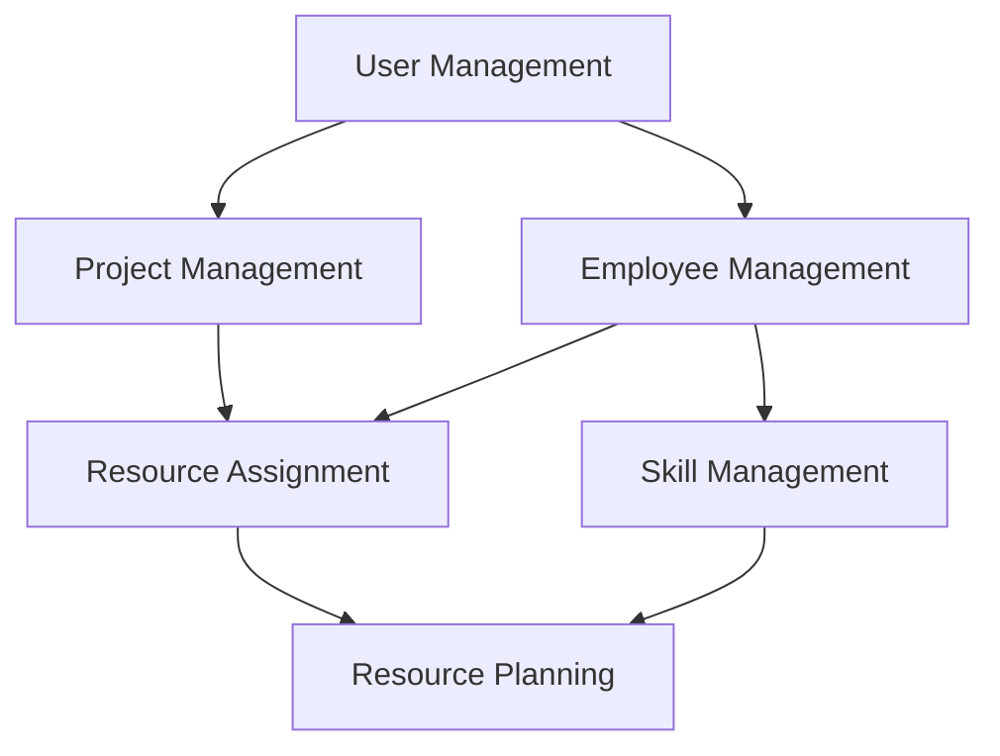

# Project Requirements and Implementation Plan

## System Overview

## Priority Levels
- P1: Must have for MVP (Critical Path)
- P2: Important but not blocking MVP
- P3: Nice to have
- P4: Future enhancement

## 1. User Management (P1)

### US-1: Administrator User Management
**Als** Administrator  
**möchte ich** Benutzer anlegen können  
**damit** sie auf das System zugreifen können

#### Requirements (REQ-1.x)
- REQ-1.1: Benutzeranlage durch Admins
  - Status: 🟡 In Progress
  - Implementation: Authentication/users table
  - Notes: Basic DB structure ready

#### Acceptance Criteria
- [ ] User Creation Form:
  - Username (required, min 3 chars, alphanumeric)
  - Password (required, min 8 chars, 1 uppercase, 1 number, 1 special char)
  - Role selection (required, "admin" or "project_leader")
- [ ] Validation:
  - Username uniqueness in real-time
  - Password complexity during input
  - Required fields completeness
- [ ] Success Flow:
  - Confirmation email sent
  - Immediate login enabled
  - Admin success message
- [ ] Error Handling:
  - Form data retention (except password)
  - Field-specific error messages
  - No user creation on validation errors

## 2. Project Management (P1)

### US-2: Project Creation and Management
**Als** Administrator oder Projektleiter  
**möchte ich** neue Projekte erstellen und verwalten können  
**damit** ich den Projektstatus und relevante Informationen verfolgen kann

#### Requirements (REQ-2.x)
- REQ-2.1: Project CRUD Operations
  - Status: 🟡 In Progress
  - Implementation: Projects API/DB
  - Notes: DB schema ready
- REQ-2.2: Project Archiving
  - Status: 🔴 Not Started
  - Implementation: is_archived flag

#### Acceptance Criteria
- [x] Project Creation Form:
  - Name (required, unique, 3-50 chars)
  - Start Date (required, not in past)
  - End Date (required, after Start Date)
  - Project Leader (required, active employees dropdown)
  - Documentation Links (optional, valid URLs)
- [x] Project Creation Flow:
  - Project Leader availability check
  - Automatic 20% minimum allocation
  - Immediate project overview update
- [x] Project Modification:
  - Change history logging
  - No duration reduction with existing assignments
  - Project Leader email notifications

### US-2.1: Project Resource Assignment (P2)
**Als** Projektleiter  
**möchte ich** Mitarbeiter mit spezifischen Zeiträumen Projekten zuweisen können  
**damit** ich die Ressourcenplanung effektiv verwalten kann

#### Acceptance Criteria
- [ ] Assignment Form:
  - Start/End Dates (within project duration)
  - Allocation (10-100%, 10% steps)
  - No overlap with absences
- [ ] Multiple Assignments:
  - Total allocation ≤ 100%
  - Warning at > 80%
  - Employee assignment overview

## 3. Employee Management (P1-P2)

### US-3.1: Basic Employee Management (P1)
**Als** Administrator  
**möchte ich** Mitarbeiter anlegen und deren Stammdaten verwalten können  
**damit** ich eine zentrale Mitarbeiterdatenbank pflegen kann

#### Requirements (REQ-3.x)
- REQ-3.1: Employee CRUD
  - Status: ✅ Complete
  - Implementation: Employees API/DB
  - Notes: All endpoints working
- REQ-3.2: Qualification Management
  - Status: ✅ Complete
  - Implementation: qualifications array
- REQ-3.3: Absence Management
  - Status: 🔴 Not Started
  - Implementation: Absences API/DB
  - Notes: DB schema ready

#### Acceptance Criteria
- [x] Employee Creation:
  - Name (required, 2-50 chars)
  - Employee Number (required, unique, "EMP-YYYY-XXXX")
  - Start Date (required, not in future)
  - Contract End (optional, after Start Date)
  - Email (required, valid format, company domain)
  - Phone (required, valid format)
- [x] Data Management:
  - Automatic versioning
  - Editor and timestamp logging
  - HR notifications

### US-3.2: Qualification Management (P3)
**Als** Administrator  
**möchte ich** die Qualifikationen und Fähigkeiten der Mitarbeiter verwalten können  
**damit** ich passende Mitarbeiter für Projekte finden kann

#### Acceptance Criteria
- [ ] Skill Recording:
  - Technical Skills (name, level 1-5, years, last use)
  - Certifications (name, issue date, expiry, PDF)
  - Languages (ISO list, A1-C2, optional cert)
  - Soft Skills (category, rating 1-5, notes)
- [ ] Skill Matching:
  - Search by single/combined skills
  - Filter by skill level
  - Certificate expiry consideration
  - Export functionality

## 4. Resource Planning and Analysis (P2-P3)

### US-4.1: Resource Utilization (P2)
**Als** Projektleiter oder Administrator  
**möchte ich** die Ressourcenauslastung visualisieren können  
**damit** ich Engpässe und Optimierungspotenziale erkennen kann

#### Requirements (REQ-4.x)
- REQ-4.1: Resource Overview
  - Status: 🔴 Not Started
  - Implementation: Reports API
- REQ-4.2: Team Filtering
  - Status: 🔴 Not Started
  - Implementation: Filter logic

#### Acceptance Criteria
- [ ] Timeline View:
  - Monthly scrollable view
  - Color-coded utilization
  - Project detail drill-down
  - Team/Skill filtering
- [ ] Utilization Calculation:
  - Part-time consideration
  - Absence integration
  - Over/Under-utilization warnings

## Implementation Timeline

### Phase 1: Foundation (Sprints 1-2)
- Setup development environment
- User management implementation
- Basic employee management

### Phase 2: Core Data (Sprints 3-4)
- Complete employee management
- Project management implementation
- Basic data validation

### Phase 3: Resource Management (Sprints 5-6)
- Resource assignment functionality
- Basic availability calculation
- Absence management

### Phase 4: Planning Tools (Sprints 7-8)
- Enhanced availability management
- Resource utilization views
- Basic reporting

### Phase 5: Enhancement (Sprints 9-10)
- Qualification management
- Skill tracking
- Advanced reporting

## Success Metrics

### System Adoption
- 100% user registration
- Daily active users > 80%

### Data Quality
- Resource allocation accuracy > 95%
- Project data completeness > 98%

### Performance
- Page load times < 2s
- Report generation < 5s

### Business Impact
- Resource utilization improvement > 15%
- Planning efficiency improvement > 25%

## Risk Assessment

### Technical Risks
1. Data consistency in concurrent operations
2. Performance with large datasets
3. Integration complexity between modules

### Business Risks
1. User adoption of new system
2. Data migration from existing systems
3. Process changes required

## Dependencies
- REQ-2.1 → REQ-1.1 (Projects need Users for project_leader)
- REQ-3.3 → REQ-3.1 (Absences need Employees)
- REQ-4.1 → REQ-2.1, REQ-3.1 (Reports need Projects and Employees)

## Review and Adjustment
- Weekly progress reviews
- Bi-weekly stakeholder demos
- Monthly milestone assessments
- Quarterly strategy alignment

## Status Legend
- ✅ Complete
- 🟡 In Progress
- 🔴 Not Started