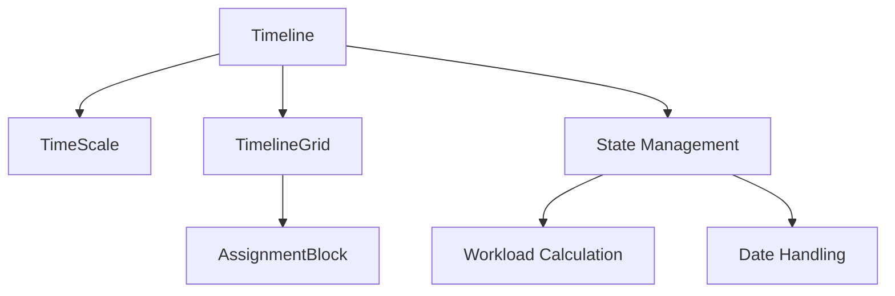

# Timeline Component Technical Overview

## Architecture

### Component Structure
```
Timeline/
├── TimelineGrid/      # Base grid and layout
├── TimeScale/        # Navigation and controls
├── AssignmentBlock/  # Individual assignments
└── shared/          # Common utilities
```

### Data Flow


## Core Components

### Timeline
```typescript
interface TimelineProps {
  assignments: AssignmentWithRelations[];
  onAssignmentUpdate: (assignment: AssignmentWithRelations) => void;
  onAssignmentEdit: (assignment: AssignmentWithRelations) => void;
  onAssignmentDelete?: (assignmentId: number) => void;
}
```
Primary container managing state and coordination between child components.

### TimelineGrid
```typescript
interface TimelineGridProps {
  startDate: Date;
  endDate: Date;
  scale: 'day' | 'week' | 'month';
  children: React.ReactNode;
}
```
Handles grid layout and time-based positioning.

### TimeScale
```typescript
interface TimeScaleProps {
  startDate: Date;
  endDate: Date;
  scale: 'day' | 'week' | 'month';
  onScaleChange: (scale: 'day' | 'week' | 'month') => void;
  onDateRangeChange: (start: Date, end: Date) => void;
}
```
Manages navigation and time scale controls.

### AssignmentBlock
```typescript
interface AssignmentBlockProps {
  assignment: AssignmentWithRelations;
  timelineStart: Date;
  columnWidth: number;
  onResize: (start: Date, end: Date) => void;
  onMove: (start: Date, end: Date) => void;
  onEdit: () => void;
  onDelete?: () => void;
}
```
Handles individual assignment display and interaction.

## State Management

### Timeline State
```typescript
interface TimelineState {
  dateRange: {
    start: Date;
    end: Date;
  };
  scale: 'day' | 'week' | 'month';
  selection: number[]; // Assignment IDs
  dragState: {
    type: 'move' | 'resize';
    assignmentId: number;
    startX: number;
    originalDates: {
      start: Date;
      end: Date;
    };
  } | null;
}
```

### Workload Calculation
```typescript
interface WorkloadState {
  value: number;
  isWarning: boolean;
  isError: boolean;
  message: string;
}

const calculateWorkload = (
  assignments: AssignmentWithRelations[],
  date: Date,
  excludeId?: number
): WorkloadState => {
  // Implementation details in useWorkload hook
};
```

## Key Features

### Drag and Drop
- Uses native browser events
- Handles both move and resize
- Real-time validation
- Snapping to grid

### Date Handling
- All dates in ISO format
- Timezone-aware calculations
- Date-fns for manipulations
- Consistent formatting

### Workload Visualization
- Real-time calculation
- Warning thresholds
- Conflict detection
- Visual feedback

## Extension Points

### Custom Views
```typescript
interface TimelineViewConfig {
  id: string;
  name: string;
  component: React.ComponentType<TimelineViewProps>;
  options?: Record<string, any>;
}

const registerView = (config: TimelineViewConfig) => {
  // Registration logic
};
```

### Custom Actions
```typescript
interface TimelineAction {
  id: string;
  label: string;
  icon?: React.ReactNode;
  handler: (context: TimelineActionContext) => void;
  isVisible?: (context: TimelineActionContext) => boolean;
}
```

### Styling
```typescript
interface TimelineTheme {
  colors: {
    grid: string;
    assignment: string;
    warning: string;
    error: string;
  };
  dimensions: {
    rowHeight: number;
    headerHeight: number;
    minColumnWidth: number;
  };
}
```

## Performance Considerations

### Rendering Optimization
1. Virtual scrolling for large datasets
2. Memoization of expensive calculations
3. Debounced updates
4. Canvas rendering for grid

### Data Management
1. Cached workload calculations
2. Lazy loading of details
3. Batch updates
4. Optimistic UI updates

### Event Handling
1. Throttled drag events
2. Debounced resize events
3. Batched state updates
4. Efficient re-renders

## Testing Strategy

### Unit Tests
```typescript
describe('Timeline', () => {
  it('should handle date range changes', () => {
    // Test implementation
  });
  
  it('should validate workload', () => {
    // Test implementation
  });
});
```

### Integration Tests
```typescript
describe('Timeline Integration', () => {
  it('should update assignments', () => {
    // Test implementation
  });
  
  it('should handle conflicts', () => {
    // Test implementation
  });
});
```

### Performance Tests
```typescript
describe('Timeline Performance', () => {
  it('should render large datasets', () => {
    // Test implementation
  });
  
  it('should handle rapid updates', () => {
    // Test implementation
  });
});
```

## API Integration

### Assignment Service
```typescript
interface AssignmentService {
  getAssignments(params: GetAssignmentsParams): Promise<AssignmentWithRelations[]>;
  updateAssignment(id: number, data: UpdateAssignmentDto): Promise<void>;
  validateWorkload(params: ValidateWorkloadParams): Promise<WorkloadState>;
}
```

### Event System
```typescript
interface TimelineEvents {
  onAssignmentChange: (assignment: AssignmentWithRelations) => void;
  onSelectionChange: (assignmentIds: number[]) => void;
  onViewChange: (params: ViewChangeParams) => void;
  onError: (error: TimelineError) => void;
}
```

## Error Handling

### Error Types
```typescript
type TimelineError =
  | 'VALIDATION_ERROR'
  | 'UPDATE_ERROR'
  | 'LOAD_ERROR'
  | 'RENDER_ERROR';

interface TimelineErrorContext {
  type: TimelineError;
  message: string;
  details?: Record<string, any>;
}
```

### Recovery Strategies
1. Automatic retry for network errors
2. State rollback for failed updates
3. Graceful degradation
4. Error boundaries

## Future Considerations

### Planned Features
1. Resource allocation view
2. Team planning tools
3. Custom views
4. Export capabilities

### Technical Debt
1. Optimize performance
2. Improve test coverage
3. Refactor date handling
4. Enhance documentation

### Integration Points
1. Calendar systems
2. Project management tools
3. Resource planning
4. Reporting systems